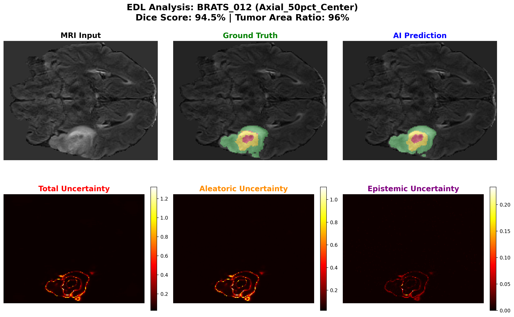
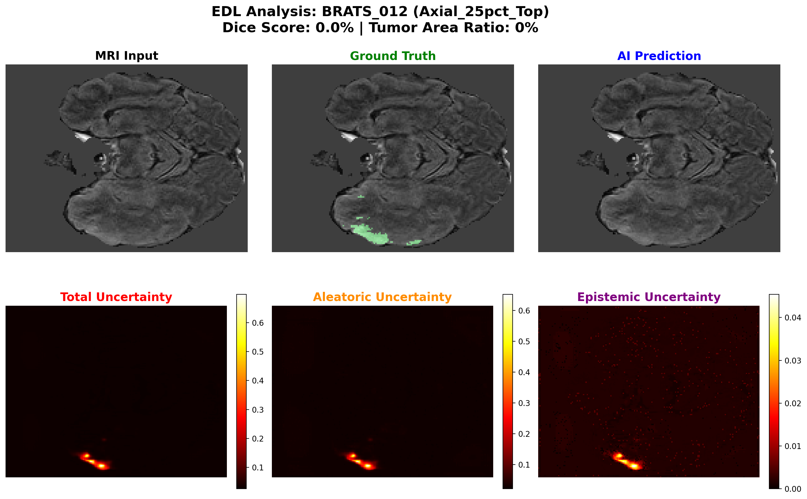
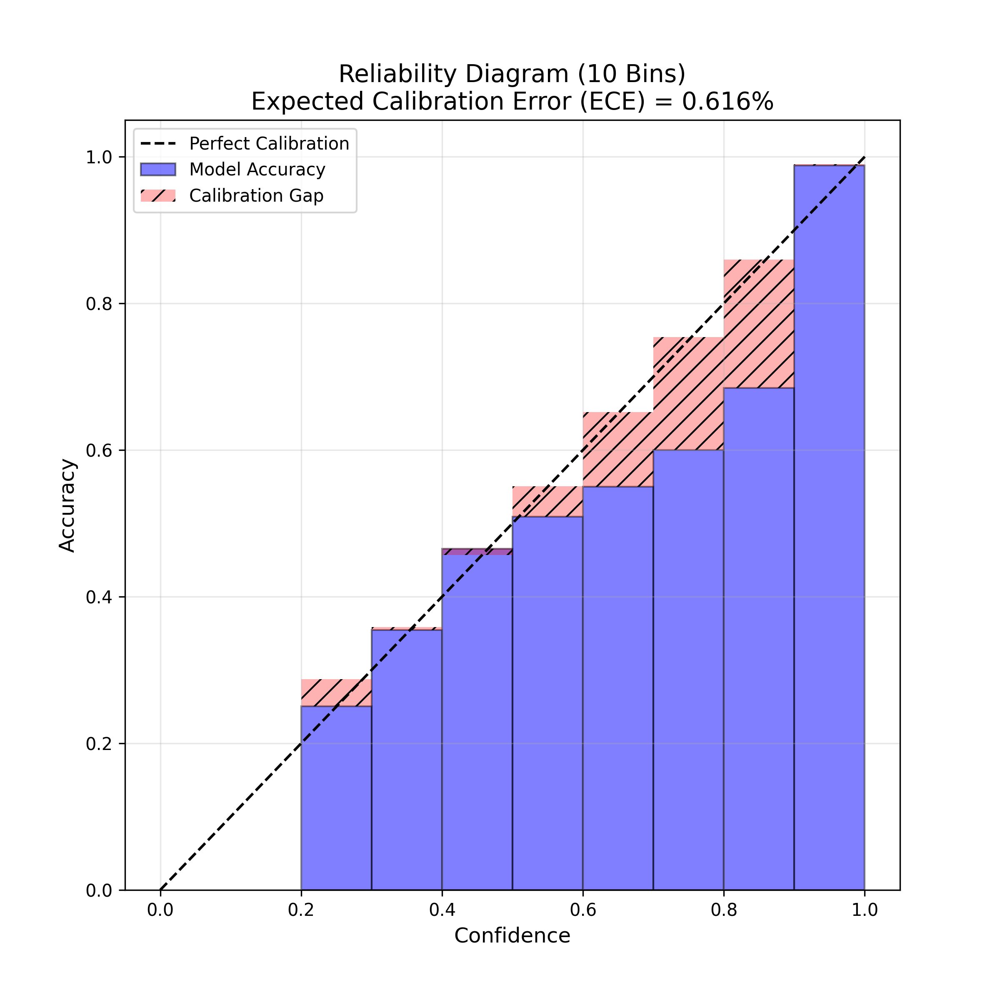
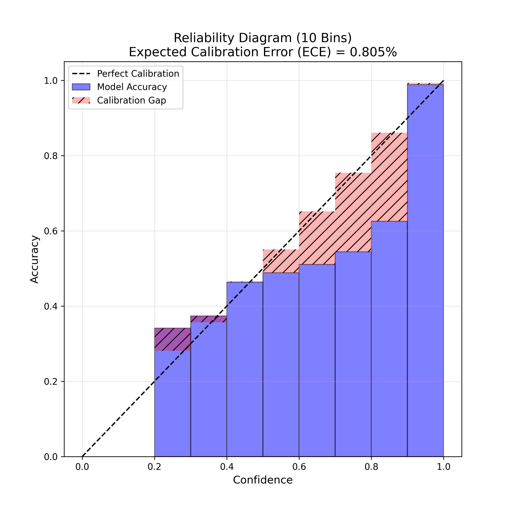
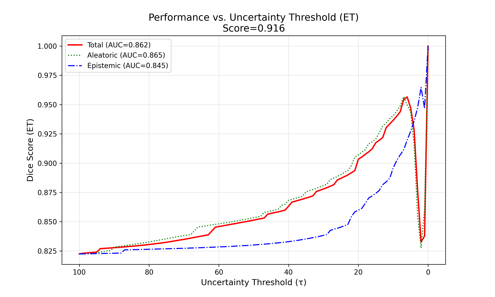

# Evidential nnU-Net: Highly Accurate Brain Tumor Segmentation with Reliable Uncertainty Decomposition

Repository này chứa mã nguồn và tài liệu thực nghiệm cho phương pháp tích hợp **Evidential Deep Learning (EDL)** vào khung làm việc **nnU-Net v2** nhằm giải quyết bài toán phân đoạn khối u não đa phương thức trên tập dữ liệu **BraTS 2020**.

Mục tiêu chính của dự án là cung cấp khả năng **Ước lượng độ bất định (Uncertainty Quantification)** có độ tin cậy cao và phân rã chúng thành hai thành phần riêng biệt: **Aleatoric** (do nhiễu dữ liệu) và **Epistemic** (do thiếu hụt tri thức của mô hình). Đặc biệt, phương pháp đề xuất duy trì và vượt qua hiệu năng phân đoạn của mô hình Baseline SOTA mà không cần tăng chi phí tính toán (single forward pass).


## Trực quan hóa kết quả phân đoạn
Chú thích:

- <b>Hàng trên</b>: MRI Input, Ground Truth, AI Prediction. 

- <b>Hàng dưới</b>: Total Uncertainty, Aleatoric Uncertainty (nhiễu dữ liệu viền khối u) và Epistemic Uncertainty (vùng mô hình thiếu tự tin).

<br>



<b>Hình 1.</b> Minh họa dự đoán, quá trình tạo bản đồ bất định và phân rã độ bất định 

<br>



<b>Hình 2.</b> Minh họa độ bất định, dễ thấy dù mô hình thất bại hoàn toàn trong dự đoán khối U nhưng độ bất định đã sáng lên và bắt rất tốt.


---

## 1. Giới thiệu

Phân đoạn khối u não tự động đã đạt được hiệu suất cực kỳ ấn tượng với các kiến trúc CNN 3D tiên tiến như nnU-Net. Tuy nhiên, trong y khoa, việc chỉ đưa ra dự đoán "cứng" (hard prediction) là chưa đủ. Các bác sĩ cần biết **mô hình tự tin đến mức nào** vào dự đoán đó để tránh các can thiệp sai lầm.

Các phương pháp ước lượng bất định truyền thống như Monte Carlo Dropout hay Deep Ensemble thường mắc phải hai nhược điểm chí mạng:

1. Chi phí tính toán khổng lồ (phải chạy suy luận nhiều lần hoặc train nhiều mô hình).
2. Thường đánh đổi độ chính xác phân đoạn (Accuracy) để lấy độ hiệu chuẩn (Calibration).

Dự án này đề xuất **Evidential nnU-Net**, một giải pháp thay thế lớp Softmax truyền thống bằng phân phối Dirichlet. Kỹ thuật này trực tiếp mô hình hóa mật độ xác suất của các lớp phân đoạn, cho phép tính toán độ bất định chỉ trong **một lần truyền xuôi (single forward pass)** với độ chính xác vượt trội. Đồng thời hiệu chuẩn ECE (Expected Calibration Error), điểm số QuBraTS vượt các phương pháp SOTA (State of the Art) hiện tại.

---

## 2. Phương pháp luận

### 2.1. Kiến trúc nền tảng (nnU-Net v2)

* **Framework:** Kế thừa sự tự động hóa cấu hình xuất sắc của nnU-Net v2.
* **Mạng Backbone:** 3D U-Net (Full resolution) xử lý đa phương thức (T1, T1ce, T2, FLAIR).
* **Chiến lược huấn luyện:** Chuẩn mực 5-fold Cross Validation để đảm bảo tính khách quan và công bằng cao nhất khi so sánh. Chúng tôi sử dụng seed chia tập huấn luyện và kiểm thử theo mặc định của nnUnet (`split_seed = 12345`)

### 2.2. Evidential Deep Learning (EDL)

Chúng tôi tùy biến quy trình huấn luyện của nnU-Net thông qua class `EDLLoss` và `EDLTrainer`:


$$
\mathcal{L}_{\text{Total}} = \underbrace{\mathcal{L}_{\text{Bayes}}}_{\text{Accuracy}} + \lambda_t \cdot \underbrace{\mathcal{L}_{\text{KL}}}_{\text{Reliability}} + \underbrace{\mathcal{L}_{\text{Dice}}(\alpha / S)}_{\text{Segmentation}}
$$

* **Hàm kích hoạt bằng chứng:** Thay thế Softmax bằng Softplus để đảm bảo bằng chứng (evidence) thu thập được luôn là số dương.
* **Hàm mất mát (Custom Loss) đa thành phần:**
1. **Expected Cross-Entropy (Data Fit Loss):** Tối ưu hóa dự đoán sát với Ground Truth dựa trên kỳ vọng của phân phối Dirichlet.
2. **KL Divergence Penalty (với Annealing Step):** Phạt nghiêm khắc các dự đoán "tự tin thái quá" ở những vùng mô hình đoán sai, ép mô hình trở về phân phối Uniform khi gặp dữ liệu lạ.
3. **Dice Loss:** Khắc phục tình trạng mất cân bằng lớp cực đoan trong ảnh y tế, tối ưu hóa trực tiếp độ trùng lặp không gian (spatial overlap).


### 2.3. Cơ chế Phân rã độ bất định

Dựa trên lý thuyết độ tin cậy Dempster-Shafer, tổng độ bất định (Total Uncertainty) được tách bạch rõ ràng thành:


$$
\underbrace{\mathcal{I}[y,\theta]}_{\text{Epistemic}} = \underbrace{H[\mathbb{E}[p]]}_{\text{Total}} - \underbrace{\mathbb{E}[H[p]]}_{\text{Aleatoric}}
$$

### a. Total Uncertainty
Entropy của xác suất trung bình.

$$
\mathcal{U}_{Total} = -\sum_k \hat{p}_k \ln \hat{p}_k
$$

*(Sự hỗn loạn của quyết định cuối)*


### b. Aleatoric Uncertainty
Trung bình entropy của từng điểm (sử dụng hàm Digamma $\psi$).

$$
\mathcal{U}_{Aleatoric} = \sum_k \hat{p}_k \left( \psi(S+1) - \psi(\alpha_k+1) \right)
$$

*(Độ nhiễu của dữ liệu)*


### c. Epistemic Uncertainty
Phần dư của phép trừ:

$$
\mathcal{U}_{Epistemic} = \mathcal{U}_{Total} - \mathcal{U}_{Aleatoric}
$$

- Đo lường sự **phân tán của đám mây xác suất** -> Có thể dùng để **phát hiện dữ liệu lạ (OOD)**

* **Aleatoric Uncertainty (Nhiễu dữ liệu):** Bắt nguồn từ chất lượng ảnh MRI kém, ranh giới mờ nhạt giữa khối u và mô lành. Sự bất định này không thể giảm bớt dù có train thêm dữ liệu.
* **Epistemic Uncertainty (Độ thiếu hiểu biết của mô hình):** Bắt nguồn từ việc mô hình chưa gặp dạng khối u này bao giờ (Out-of-Distribution). Có thể được khắc phục bằng cách thu thập thêm dữ liệu huấn luyện.


## 3. Phân tích Hiện tượng "Overconfidence" và Sự ưu việt của EDL

Trong các bài toán phân vùng y tế, các mô hình học sâu thường mắc phải hội chứng **Tự tin thái quá (Overconfidence)**. Khi cố gắng tối ưu hóa Dice Score, mô hình có xu hướng đẩy xác suất dự đoán lên tiệm cận 1.0 (100%) ngay cả ở những vùng biên mờ mịt. 

Lý do là các mô hình phân loại tối ưu độ chính xác (trong ngữ cảnh bài toán này là dice), cố xuất ra giá trị xác suất cao nhất ở lớp mà mô hình tin là đúng với mục tiêu đẩy hàm loss về 0. Điều này vô tình làm cho chỉ số ECE của các mô hình này rất cao (tệ), bởi vì các mẫu tự tin nhất đều đã bị đẩy vô bin cuối cùng, các mẫu kém tự tin hơn ở **các** bin còn lại có nhiều xác suất là dự đoán sai. Điều này làm tăng sai số hiệu chuẩn kỳ vọng (**Expected Calibration Error - ECE**).

EDL giải quyết triệt để vấn đề này bằng cách hấp thụ phần "xác suất ảo" vào một đại lượng bất định (Uncertainty), giúp mô hình giữ được sự khiêm tốn cần thiết.


*> Hình 3a: Baseline nnU-Net (50 Epochs). Mặc dù mới ở giai đoạn đầu huấn luyện, mô hình đã tỏ ra quá tự tin, tạo ra các "Calibration Gap" (vùng gạch chéo đỏ) lớn ở các bin xác suất cao. ECE lên tới 1.536%.*




*> Hình 3b: Evidential nnU-Net (50 Epochs). Nhờ cơ chế phạt KL Divergence, EDL kiểm soát độ tự tin cực tốt, bám sát đường Perfect Calibration (đứt nét). ECE giảm mạnh chỉ còn 0.616%.*




*> Hình 3c: Evidential nnU-Net (250 Epochs). Khi huấn luyện dài hạn, mô hình đạt đỉnh cao về độ chính xác (Dice). Dù có xu hướng tự tin hơn, EDL vẫn gồng gánh xuất sắc để giữ ECE ở mức an toàn 0.805% (thấp hơn một nửa so với Baseline 50 epochs).*

---

## 4. Kết quả Thực nghiệm & Benchmark SOTA

Mô hình được huấn luyện và đánh giá trên hai kịch bản để đảm bảo tính khách quan và minh bạch học thuật:
1. **5-fold Cross Validation (369 ca):** Đánh giá toàn diện trên toàn bộ tập dữ liệu huấn luyện (chuẩn khắt khe nhất của nnU-Net).
2. **Fixed Split Test Set (74 ca):** Sử dụng tập Validation của Fold 0 làm tập kiểm thử độc lập, nhằm đối chiếu công bằng với các phương pháp SOTA khác thường tự chia tập test.

### 4.1. Hiệu năng tổng thể (Dice, HD95 & ECE)

*Cấu hình: TTA (Test Time Augmentation), trượt 50%. HD95 (mm) và ECE (%) càng thấp càng tốt, Mean Dice (%) và BraTS Score càng cao càng tốt.*

#### Bảng 1: Đánh giá 5-Fold Cross Validation (Tổng 369 ca)

| Phương pháp | Epochs | Mean Dice ↑ | WT | TC | ET | Mean HD95 ↓ | WT | TC | ET | ECE (%) ↓ | BraTS Score ↑ |
| :--- | :---: | :---: | :---: | :---: | :---: | :---: | :---: | :---: | :---: | :---: | :---: |
| Baseline nnU-Net v2 | 50 | 87.173 | 92.529 | 89.921 | 79.071 | 11.597 | 3.756 | 3.692 | 27.344 | 1.536 | - |
| **Evidential nnU-Net** | **50** | 85.346 | 92.060 | 87.978 | 76.001 | 12.322 | 3.879 | 4.205 | 28.883 | **0.616** | 0.902 |
| Baseline nnU-Net v2 | 250 | **89.488** | 93.768 | 92.222 | 82.473 | **10.102** | 2.740 | 3.024 | 24.542 | 1.250 | - |
| **Evidential nnU-Net** | **250** | 88.963 | 93.633 | 92.003 | 81.254 | 10.709 | **2.713** | **2.821** | 26.594 | **0.805** | **0.930** |

#### Bảng 2: Đánh giá trên tập Fixed Split Test (74 ca)

| Phương pháp | Epochs | Mean Dice ↑ | WT | TC | ET | Mean HD95 ↓ | WT | TC | ET | ECE (%) ↓ | BraTS Score ↑ |
| :--- | :---: | :---: | :---: | :---: | :---: | :---: | :---: | :---: | :---: | :---: | :---: |
| Baseline nnU-Net v2 | 50 | 88.030 | 92.010 | 89.040 | 83.030 | 8.088 | 5.723 | 4.970 | 13.570 | 1.790 | - |
| **Evidential nnU-Net** | **50** | 87.410 | 91.580 | 88.260 | 82.390 | 7.168 | **4.880** | **3.864** | **12.761** | **1.052** | 0.912 |
| Baseline nnU-Net v2 | 250 | 88.173 | 91.692 | 89.262 | 83.566 | 7.218 | 5.369 | 3.876 | **12.410** | 2.049 | - |
| **Evidential nnU-Net** | **250** | **88.503** | 91.948 | 89.588 | 83.974 | **6.896** | **4.551** | **3.477** | 12.659 | **1.584** | **0.930** |

**Phân tích các phát hiện quan trọng:**
* **Bảo toàn ECE khi huấn luyện dài hạn:** Khi tăng từ 50 lên 250 epochs, mô hình có xu hướng tự tin hơn (ECE tăng nhẹ). Tuy nhiên, nhờ thiết lập Annealing Step (100 epochs đầu) phạt nặng KL Divergence, mô hình EDL của nhóm vẫn duy trì ECE thấp hơn đáng kể so với Baseline ở mọi mốc (ví dụ: 0.805% so với 1.250% tại 250 epochs 5-Fold).
* **Đường biên mượt mà hơn ở WT và TC:** Ở các cấu trúc lớn như WT và TC, EDL nhất quán đạt chỉ số khoảng cách Hausdorff (HD95) tốt hơn Baseline, đặc biệt trên tập Fixed Test. Điều này cho thấy EDL giúp giảm các dự đoán sai lệch cục bộ nằm xa ranh giới thực tế. Tuy nhiên, Mean HD95 tổng thể vẫn chịu ảnh hưởng mạnh từ lớp ET.
* **Sự bứt phá trên tập dữ liệu chưa gặp (Unseen Data):** Dù ở 5-Fold CV, EDL 250 epochs có Mean Dice (88.963%) thấp hơn Baseline một chút (89.488%), nhưng khi đánh giá trên tập Fixed Test độc lập, EDL lại vượt lên (88.503% so với 88.173%). Lớp khó nhất là ET cũng ghi nhận sự vượt trội của EDL trên tập Fixed Test (83.974% so với 83.566%).

### 4.2. So sánh với các phương pháp SOTA (BraTS 2020)

Kết quả của nhóm được đặt lên bàn cân với các kiến trúc tiên tiến nhất hiện nay. Các kết quả Baseline của nhóm cũng được đưa vào để làm hệ quy chiếu gốc.

| Phương pháp | Toàn bộ khối u (WT) | Lõi khối u (TC) | U tăng quang (ET) | Mean Dice | Phương pháp đánh giá |
| :--- | :---: | :---: | :---: | :---: | :--- |
| dResU-Net | 86.600 | 83.570 | 80.040 | 83.400 | Tự chia (Custom split) |
| ADHDC-Net | 89.750 | 83.310 | 78.010 | 83.690 | Tự chia (Custom split) |
| nnU-Net Ensemble | 91.000 | 84.400 | 77.600 | 84.800 | Tự chia (Custom split) |
| H2NF-Net | 91.300 | 85.500 | 78.800 | 86.200 | Tự chia (Custom split) |
| Standard nnU-Net v1 | 91.070 | 87.970 | 81.370 | 87.070 | 5-Fold CV |
| *Energy-Based Attention* | *89.130* | *88.970* | **87.470** | *88.520* | Tự chia (Custom split) |
| Baseline nnU-Net v2 nhóm tự train (50 ep) | 92.529 | 89.921 | 79.071 | 87.173 | 5-Fold CV |
| Evidential nnU-Net (50 ep) | 91.580 | 88.260 | 82.390 | 87.410 | Fixed Test (74 ca) |
| Baseline nnU-Net v2 nhóm tự train (250 ep) | 93.768 | 92.222 | 82.473 | **89.488** | 5-Fold CV |
| **Evidential nnU-Net (Ours - 250 ep)** | 91.948 | 89.588 | 83.974 | 88.503 | **Fixed Test (74 ca)** |
| **Evidential nnU-Net (Ours - 250 ep)** | **93.633** | **92.003** | 81.254 | 88.963 | **5-Fold CV** |

*> Nhận xét:* Kết quả của nhóm cho thấy năng lực cạnh tranh rất mạnh về Mean Dice so với các nghiên cứu tham chiếu. Ngay cả khi đối mặt với Baseline mạnh mẽ của nnU-Net v2, EDL vẫn bám sát về độ chính xác và thể hiện ưu thế rõ rệt ở khả năng khoanh vùng **Toàn bộ khối u** (WT: 93.633%) và **Lõi khối u** (TC: 92.003%) trong thiết lập 5-Fold CV. Tuy nhiên, cần lưu ý rằng các công trình đối sánh trong bảng không hoàn toàn sử dụng cùng một protocol đánh giá, nên kết luận về SOTA tuyệt đối cần được diễn giải thận trọng.

### 4.3. Đánh giá chất lượng Độ bất định (Uncertainty Benchmark)

**Lưu ý:** Đa số các bài báo tham chiếu dưới đây sử dụng tệp dữ liệu tự chia. Nhóm trình bày song song kết quả của Fixed Test (để so sánh đối chuẩn) và 5-Fold CV (để đánh giá toàn diện).

| Phương pháp | Mean Dice ↑ | ECE (%) ↓ | BraS* ↑ | Ghi chú & Cấu hình |
| :--- | :---: | :---: | :---: | :--- |
| Deep Ensemble | 0.807 | 1.000 | 0.873 | Tốn gấp $N$ lần chi phí tính toán |
| MC Dropout | 0.804 | 0.900 | 0.869 | Phải lấy mẫu nhiều lần (Multiple passes) |
| EDL (TBraTS, 200 ep) | 0.790 | 1.900 | 0.862 | Single pass |
| EDL (Region-based, wDICE, 200 ep) | 0.793 | 1.600 | 0.874 | Single pass (Tập test 74 ca) |
| **Evidential nnU-Net (Ours - 50 ep)** | 0.853 | **0.616** | 0.902 | Single pass (5-Fold CV) |
| **Evidential nnU-Net (Ours - 250 ep)** | 0.885 | 1.584 | **0.930** | **Single pass (Fixed Test 74 ca)** |
| **Evidential nnU-Net (Ours - 250 ep)** | **0.890** | 0.805 | 0.930 | **Single pass (5-Fold CV)** |

*> Nhận xét:* Khi so sánh đối chuẩn trên cùng một hệ quy chiếu về tập dữ liệu (Fixed Test 74 ca), phương pháp đề xuất của nhóm vượt rõ rệt EDL Region-based ở cả Mean Dice (0.885 so với 0.793) và độ hiệu chuẩn ECE (1.584% so với 1.600%), đồng thời điểm QU-BraTS tăng lên 0.930.  
* Ở góc độ toàn diện (5-Fold CV, 250 epochs), kiến trúc này đạt kết quả rất mạnh khi duy trì ECE ở mức 0.805%, vượt qua cả các phương pháp tiêu tốn nhiều tài nguyên máy tính như MC Dropout hay Deep Ensemble, đồng thời giữ Mean Dice ở mức xấp xỉ 0.890.

---

**\*BraS (QU-BraTS Score).** Đây là thước đo chính thức được sử dụng trong **BraTS 2020 – Quantification of Uncertainty in Brain Tumor Segmentation (QU-BraTS) challenge** để đánh giá chất lượng của các bản đồ độ bất định (uncertainty maps).

Khác với các metric segmentation truyền thống chỉ đo độ chính xác (như Dice), QU-BraTS đánh giá liệu **độ bất định do mô hình dự đoán có thực sự tương quan với lỗi phân đoạn hay không**. Nói cách khác, một mô hình tốt không chỉ dự đoán chính xác mà còn phải **biết khi nào mình không chắc chắn**.

Metric này tổng hợp ba thành phần:

- **AUC Dice**: đo mức độ tương quan giữa độ tin cậy và chất lượng phân đoạn  
- **AUC FTP (False Tumor Positive)**: phạt nếu mô hình tự tin sai ở vùng nền  
- **AUC FTN (False Tumor Negative)**: phạt nếu mô hình tự tin bỏ sót khối u  

Điểm số cuối cùng nằm trong khoảng **[0,1]**, với **giá trị càng cao càng tốt**.



*>Hình 4: Minh họa các đường cong AUC của class ET với mô hình EDL 250 epochs*

### 4.4. Phân tích các Pattern quan trọng từ thực nghiệm

Dựa trên các kết quả định lượng ở trên, có thể rút ra một số nhận định quan trọng như sau:

**a. Mối quan hệ đánh đổi giữa số Epoch và độ hiệu chuẩn (ECE)**  
Một xu hướng nhất quán là khi tăng số epoch từ 50 lên 250, chỉ số ECE của mô hình EDL có xu hướng tăng, tức mức độ hiệu chuẩn giảm nhẹ. Cụ thể, trong thiết lập **5-Fold CV**, ECE tăng từ **0.616%** lên **0.805%**; còn trong **Fixed Test**, ECE tăng từ **1.052%** lên **1.584%**. Điều này cho thấy khi được huấn luyện lâu hơn, mô hình có xu hướng trở nên tự tin hơn để tối ưu hiệu năng phân đoạn. Tuy nhiên, nhờ cơ chế **Annealing Step** trong giai đoạn đầu huấn luyện nhằm nhấn mạnh thành phần **KL Divergence**, mô hình EDL vẫn duy trì mức ECE thấp hơn đáng kể so với Baseline ở mọi mốc đánh giá. Ví dụ, tại **250 epochs trên Fixed Test**, EDL đạt **1.584%**, thấp hơn rõ rệt so với **2.049%** của Baseline.

**b. Ưu thế về độ chính xác biên (HD95), đặc biệt trên WT và TC**  
Một pattern nổi bật là mô hình EDL thường cho kết quả **HD95 tốt hơn ở các vùng WT và TC**, đặc biệt trên tập **Fixed Test**. Chẳng hạn, tại thiết lập **250 epochs – Fixed Test**, HD95 của vùng **WT** giảm từ **5.369 mm** xuống **4.551 mm**, trong khi vùng **TC** giảm từ **3.876 mm** xuống **3.477 mm**. Điều này cho thấy dự đoán của EDL ít xuất hiện các sai lệch cục bộ nằm xa vùng ground truth hơn, từ đó tạo ra đường biên phân đoạn mượt và sát thực tế hơn. Tuy vậy, cần lưu ý rằng lợi thế này không đồng đều trên mọi lớp, và **Mean HD95 tổng thể** vẫn còn chịu ảnh hưởng mạnh bởi lớp **ET**.

**c. Hiệu năng trên lớp ET (Enhancing Tumor)**  
Lớp **ET** tiếp tục là thành phần khó nhất trong bài toán phân đoạn u não. Trong thiết lập **5-Fold CV**, Dice của EDL ở lớp ET thấp hơn Baseline một chút (**81.254%** so với **82.473%** tại 250 epochs). Tuy nhiên, trên tập **Fixed Test** ở cùng mốc huấn luyện, EDL lại vượt lên với **83.974%**, cao hơn Baseline (**83.566%**). Kết quả này cho thấy mặc dù ET là lớp thách thức, mô hình EDL vẫn thể hiện khả năng tổng quát hóa đáng chú ý.

**d. Tính minh bạch và độ tin cậy của quy trình đánh giá**  
Việc sử dụng **Validation của Fold 0** làm **Fixed Test Set** thay vì tự lựa chọn một tập test mới giúp tăng tính minh bạch và khả năng đối chiếu công bằng giữa các mô hình. Trong thiết lập này, **EDL 250 epochs** vượt Baseline cả về **Mean Dice** (**88.503%** so với **88.173%**) lẫn **ECE** (**1.584%** so với **2.049%**). Điều đó cho thấy lợi thế của EDL không chỉ xuất hiện trong đánh giá chéo toàn bộ dữ liệu mà còn được duy trì trên một tập kiểm thử độc lập, qua đó củng cố độ tin cậy của kết luận thực nghiệm.

**e. BraTS Score và chất lượng của bản đồ độ bất định**  
Chỉ số **BraTS Score** tăng đều theo số epoch, từ **0.902** tại 50 epochs lên **0.930** tại 250 epochs trong thiết lập **5-Fold CV**. Trên **Fixed Test**, chỉ số này cũng tăng từ **0.912** lên **0.930**. Xu hướng này cho thấy khi mô hình học tốt hơn về mặt phân đoạn, bản đồ độ bất định mà mô hình sinh ra cũng tương quan tốt hơn với lỗi thực tế. Nói cách khác, độ bất định do EDL tạo ra không chỉ mang tính hình thức mà còn phản ánh ngày càng sát hơn những vùng mà mô hình có nguy cơ dự đoán sai, từ đó có tiềm năng hỗ trợ chuyên gia tập trung kiểm tra các vùng khó.

## 5. Trích dẫn (Citation)

Nếu bạn sử dụng mã nguồn hoặc lấy cảm hứng từ phương pháp này cho nghiên cứu của mình, vui lòng trích dẫn các tài liệu sau:

```bibtex
@article{nguyen2026uncertainty,
  title={Evidential nnU-Net: Highly Accurate Brain Tumor Segmentation with Reliable Uncertainty Decomposition},
  author={Nguyen, Luong Dac and Son, Bui Truong Thai and Long, Ung Hoang and Nguyen-Tat, Thien B.},
  journal={Preprint submitted to Elsevier},
  year={2024}
}

@article{isensee2021nnu,
  title={nnU-Net: a self-configuring method for deep learning-based biomedical image segmentation},
  author={Isensee, Fabian and Jaeger, Paul F and Kohl, Simon AA and Petersen, Jens and Maier-Hein, Klaus H},
  journal={Nature methods},
  volume={18},
  number={2},
  pages={203--211},
  year={2021},
  publisher={Nature Publishing Group}
}

@inproceedings{isensee2020nnu,
  title={nnU-Net for brain tumor segmentation},
  author={Isensee, Fabian and J{\"a}ger, Paul F and Full, Peter M and Vollmuth, Philipp and Maier-Hein, Klaus H},
  booktitle={International MICCAI Brainlesion Workshop},
  pages={118--132},
  year={2020},
  organization={Springer}
}
